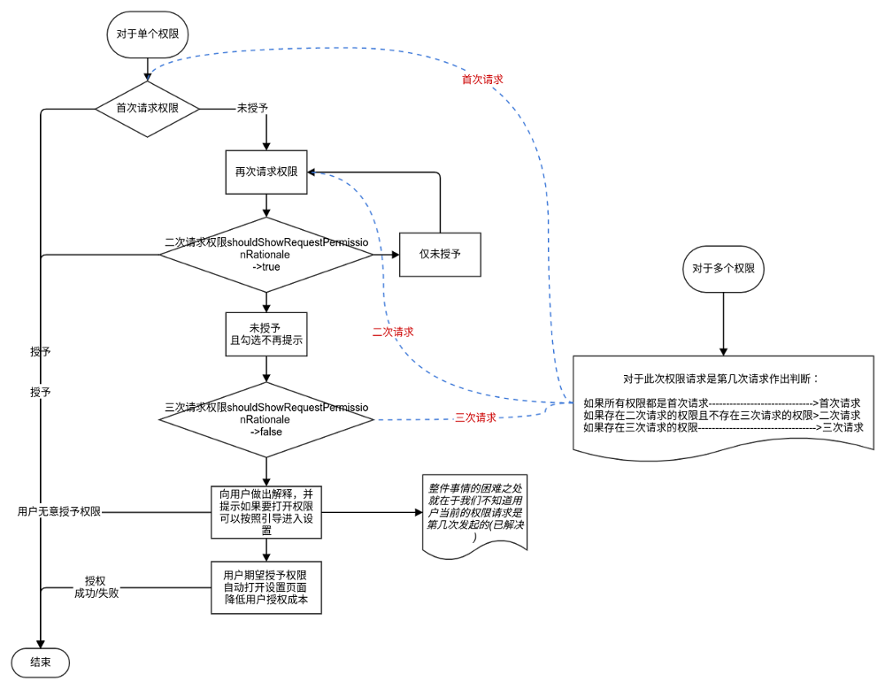

暂未投入使用, 投入使用前需要做一次测试, 谨防异常

写这段代码前重点参考了 [PermissionsDispatcher](https://github.com/permissions-dispatcher/PermissionsDispatcher)

差异：
1. 没有使用注解而是使用了链式调用的使用形式
2. 确定第是否是第三次权限请求的实现逻辑不同
    - PermissionsDispatcher 通过真正请求权限得知本次请求是否第三次请求权限
    - 本代码通过本地化标识确定是否第三次请求权限
3. 没有处理特殊权限

不足：
1. 喜欢链式调用完全是个人口味，如果有人希望我用用注解在实现一次，表示可能会接受这个建议
2. 判断是否是第三次权限请求，如果不通过本地化标识就完美了
    - 尝试过判断权限请求响应时间，最终认为准确性无法保证，舍去
    - 尝试过查看源代码找到合理的入口，未成功，舍去
    - 针对这个点如果有更好的实现方式，希望能交流


我认为的权限请求应该是这样的流程




添加依赖
```gradle
//ModuleName/build.gradle
dependencies {
    implementation 'io.github.tomgarden:lib_permission:0.3.0'
}

//ModuleName/build.gradle   OR    ProjectName/build.gradle
repositories {
    maven {
        url = uri("https://maven.pkg.github.com/TomGarden/lib_permission")

        credentials {
            //不限的 github 账户名
            username = System.getenv("TOMGARADEN_USERNAME")
            //与 github 账户名成对的 具有 read:packages 权限的 token
            password = System.getenv("TOMGARADEN_READ_PACKAGES_TOKEN")
        }
    }
}
```


### 示例代码

```kotlin
findViewById<Button>(R.id.btnRequestPermission).setOnClickListener {
            Permission(this)
                .permissions(
                    Manifest.permission.READ_PHONE_STATE,
                    Manifest.permission.READ_CONTACTS,
                    Manifest.permission.CAMERA,
                    Manifest.permission.READ_EXTERNAL_STORAGE
                )
                .secondRationale { permission, activity, allPermissionList, grantedRequestList, firstRequestList, secondRequestList ->
                    val message = "二次权限请求 \n secondRationale \n*** allpermission \n $allPermissionList " +
                            "\n*** grantedRequestList \n $grantedRequestList" +
                            "\n*** firstRequestList \n $firstRequestList " +
                            "\n*** firstRequestList \n $secondRequestList"
                    Logger.i(message)

                    AlertDialog.Builder(this)
                        .setMessage(message)
                        .setPositiveButton(
                            "continue"
                        ) { _, _ ->
                            permission.continueRequest(activity, allPermissionList.toTypedArray())
                        }
                        .setNegativeButton("cancel", null)
                        .create()
                        .show()
                }
                .thirdRationale { permission, activity, allPermissionList, grantedRequestList, firstRequestList, secondRequestList, thirdRequestList ->
                    val message = "三次权限请求 \n thirdRationale \n*** allpermission \n $allPermissionList " +
                            "\n*** grantedRequestList \n $grantedRequestList" +
                            "\n*** firstRequestList \n $firstRequestList " +
                            "\n*** secondRequestList \n $secondRequestList"
                    AlertDialog.Builder(this)
                        .setMessage(message)
                        .setPositiveButton(
                            "setting"
                        ) { _, _ ->
                            permission.goAppSetting(activity)
                        }
                        .setNegativeButton("cancel", null)
                        .create()
                        .show()
                }
                .grantedPartPermissions { }
                .deniedPartPermissions { }
                .grantedAllPermissions { }
                .deniedAllPermissions { }
                .requestPermissionsResult { allPermissionList, grantedPermissions, deniedPermissions ->
                    val message = "requestPermissionsResult " +
                            "\n*** allPermissionList \n $allPermissionList" +
                            "\n*** grantedPermissions \n $grantedPermissions" +
                            "\n*** deniedPermissions \n $deniedPermissions"

                    Logger.e(message)
                }
                //.request(this)//这种写法需要覆写 onRequestPermissionsResult 函数
                .requestSimple(this)//这种写法不需要覆写 onRequestPermissionsResult 函数
        }
```


需要覆写 onRequestPermissionsResult 的情况

```kotlin
class MainActivity : AppCompatActivity() {

    private val TAG: String = "tom.work@foxmail.com"
    private val defRequestCode = 1
    private val permissionUtil: Permission by lazy { Permission(this) }

    override fun onCreate(savedInstanceState: Bundle?) {
        super.onCreate(savedInstanceState)
        setContentView(R.layout.activity_main)

        btnLibPermission.setOnClickListener { libPerRequest() }

    }


    fun libPerRequest() {
        permissionUtil/*request 方法务必放在调用链的末尾*/
                .secondRationale { permission, activity, allPermissions, grantedRequestList, firstRequestList, secondRequestList ->
                    AlertDialog.Builder(this)
                            .setTitle("222222 二次请求前的必要解释")
                            .setMessage("对于请求权限的合理解释")
                            .setPositiveButton("授予") { dialog, which -> permission.continueRequest(activity, allPermissions.toTypedArray()) }
                            .setNegativeButton("拒绝") { dialog, which -> permission.deniedAll() }
                            .create()
                            .show()
                }
                .thirdRationale { permission, activity, allPermissions, grantedRequestList, firstRequestList, secondRequestList, thirdRequestList ->
                    AlertDialog.Builder(this)
                            .setTitle("333333 三次请求前的必要解释")
                            .setMessage("对于请求权限的合理解释")
                            .setPositiveButton("授予") { dialog, which -> permission.goAppSetting(activity) /*授予动作意味着什么由开发者决定*/ }
                            .setNegativeButton("拒绝") { dialog, which -> permission.deniedAll() }
                            .setNeutralButton("授予二次请求的部分权限") { dialog, which -> permission.continueRequest(activity, secondRequestList.toTypedArray()) }
                            .create()
                            .show()
                }
                .grantedAllPermissions {
                    Log.i(TAG, "requestPermissionsResult(…) 调用时，本接口可不必调用 ， ——grantedAllPermissions")
                    //Toast.makeText(this, "grantedAllPermissions", Toast.LENGTH_SHORT).show()
                    //Log.d(TAG, "" + telManager.deviceId)
                }
                .deniedAllPermissions {
                    Log.i(TAG, "requestPermissionsResult(…) 调用时，本接口可不必调用 ， ——deniedAllPermissions")
                    //Toast.makeText(this, "deniedAllPermissions", Toast.LENGTH_SHORT).show()
                }
                .grantedPartPermissions { list: MutableList<String> ->
                    Log.i(TAG, "requestPermissionsResult(…) 调用时，本接口可不必调用 ， ——grantedPartPermissions\t" + list.size)
                    //Toast.makeText(this, "grantedPartPermissions\t" + list.size, Toast.LENGTH_SHORT).show()
                }
                .deniedPartPermissions { list: MutableList<String> ->
                    Log.i(TAG, "requestPermissionsResult(…) 调用时，本接口可不必调用 ， ——deniedPartPermissions\t" + list.size)
                    //Toast.makeText(this, "deniedPartPermissions\t" + list.size, Toast.LENGTH_SHORT).show()
                }
                .requestPermissionsResult { allPermissionList, grantedPermissions, deniedPermissions ->
                    /*grantedAllPermissions
                      deniedAllPermissions
                      grantedPartPermissions
                      deniedPartPermissions
                      几个回调所能提供的参数在这里都能提供，具体实现哪一个取决与开发者
                      */
                    Log.i(TAG, "requestPermissionsResult")
                }
                .request(
                        this,
                        Manifest.permission.READ_PHONE_STATE,
                        Manifest.permission.READ_CONTACTS,
                        Manifest.permission.CAMERA,
                        Manifest.permission.READ_EXTERNAL_STORAGE)

    }

    override fun onRequestPermissionsResult(
            requestCode: Int, permissions: Array<out String>, grantResults: IntArray) {
        super.onRequestPermissionsResult(requestCode, permissions, grantResults)
        permissionUtil.onRequestPermissionsResult(requestCode, permissions, grantResults)
    }
}
```